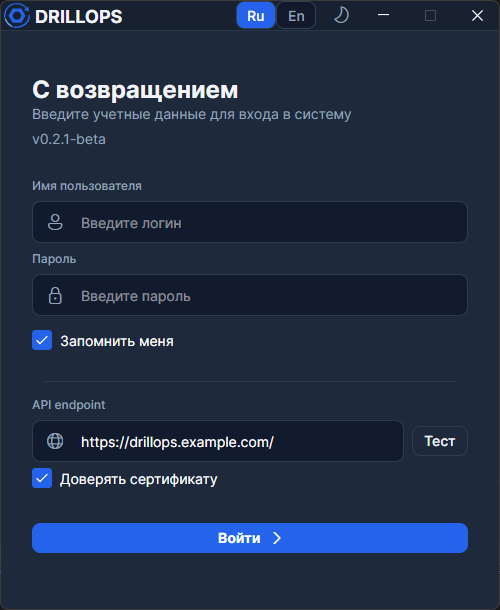
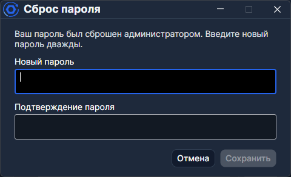

# Авторизация

## Сервер

Сначала укажите адрес вашего API в поле **API endpoint**. Если адреса нет под рукой — его выдаёт администратор.

Кнопка **Тест** проверяет, отвечает ли сервер.

> Флаг **Доверять сертификату** нужен только для самоподписанного SSL-сертификата.

## Учётные данные

Логин и пароль выдаёт администратор. Он же может сбросить пароль, если вы его забыли.

После сброса введите логин и нажмите **Войти** — откроется диалог смены пароля. Введите новый пароль дважды и нажмите **Сохранить**.

> Флаг **Запомнить меня** сохраняет логин между сессиями, но не сохраняет пароль.

