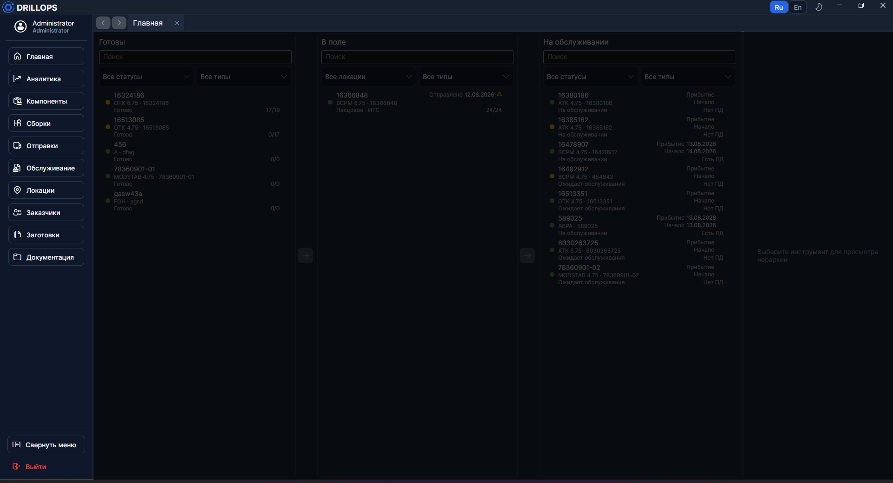

# Главное окно

## Навигация

Слева — панель навигации (на скриншоте). Сверху видны **имя пользователя** и **роль**. Нажмите пункт, чтобы открыть вкладку.

Пункты меню ведут на главы руководства: [Главная](../Рабочий%20цикл/Главная.md), [Аналитика](../Отчёты/Аналитика.md), [Компоненты](../Справочники/Компоненты.md), [Сборки](../Справочники/Сборки.md), [Отправки](../Рабочий%20цикл/Отправки.md), [Обслуживание](../Рабочий%20цикл/Обслуживание.md), [Локации](../Справочники/Локации.md), [Заказчики](../Справочники/Заказчики.md), [Заготовки описаний](../Сервис/Заготовки%20описаний.md), [Документация](../Сервис/Документация.md).

Документы вроде [полевых данных](../Рабочий%20цикл/Полевые%20данные.md), [заказ-наряда](../Рабочий%20цикл/Заказ-наряд.md) и [сводки](../Отчёты/Сводка.md) в меню нет — они открываются из других экранов.

Внизу панели: **Свернуть / развернуть меню** и **Выйти**.

> Некоторые пункты скрыты, если не хватает прав.

> Если вкладка уже открыта, повторный щелчок в меню переключит на неё, а не создаст вторую. Чтобы открыть ещё одну такую же, сначала вытащите текущую вкладку в отдельное окно.

## Вкладки

Панель вкладок — сверху окна. Кнопки **На предыдущую вкладку** и **На следующую вкладку** ходят по истории посещений, а не по порядку ярлыков.

> Вкладку можно оторвать в отдельное окно: зажмите её левой кнопкой и потяните вверх или вниз.

## Шапка

Над вкладками — переключатели **языка** (русский / английский) и **темы** (светлая / тёмная).
