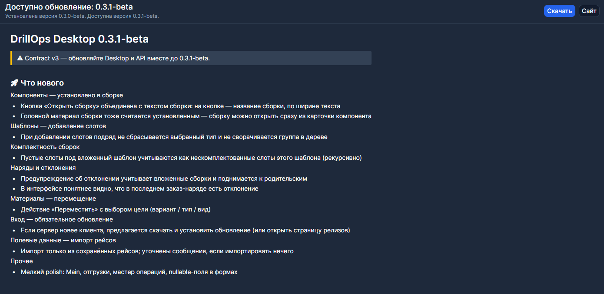

# Установка и обновление

## Установка

Скачайте актуальный установщик со страницы [релизов на GitHub](https://github.com/Vanilla76e2/DrillOps.Releases/releases) и запустите его.

> **Внимание.** Некоторые версии Desktop не совместимы с сервером. Если сомневаетесь, уточните у администратора, какую версию ставить.

## Обновление

Когда на сервере появляется совместимая новая версия, вверху окна показывается баннер **Доступно обновление**.

- **Скачать** — программа скачает установщик, проверит его и предложит установить. DrillOps при этом закроется.
- **На сайте** — откроет страницу релиза в браузере, если нужно скачать установщик вручную.

Установить можно и без баннера: скачайте файл с [той же страницы релизов](https://github.com/Vanilla76e2/DrillOps.Releases/releases).

## Что изменилось

Список изменений смотрите в описании релиза на [GitHub](https://github.com/Vanilla76e2/DrillOps.Releases/releases).
