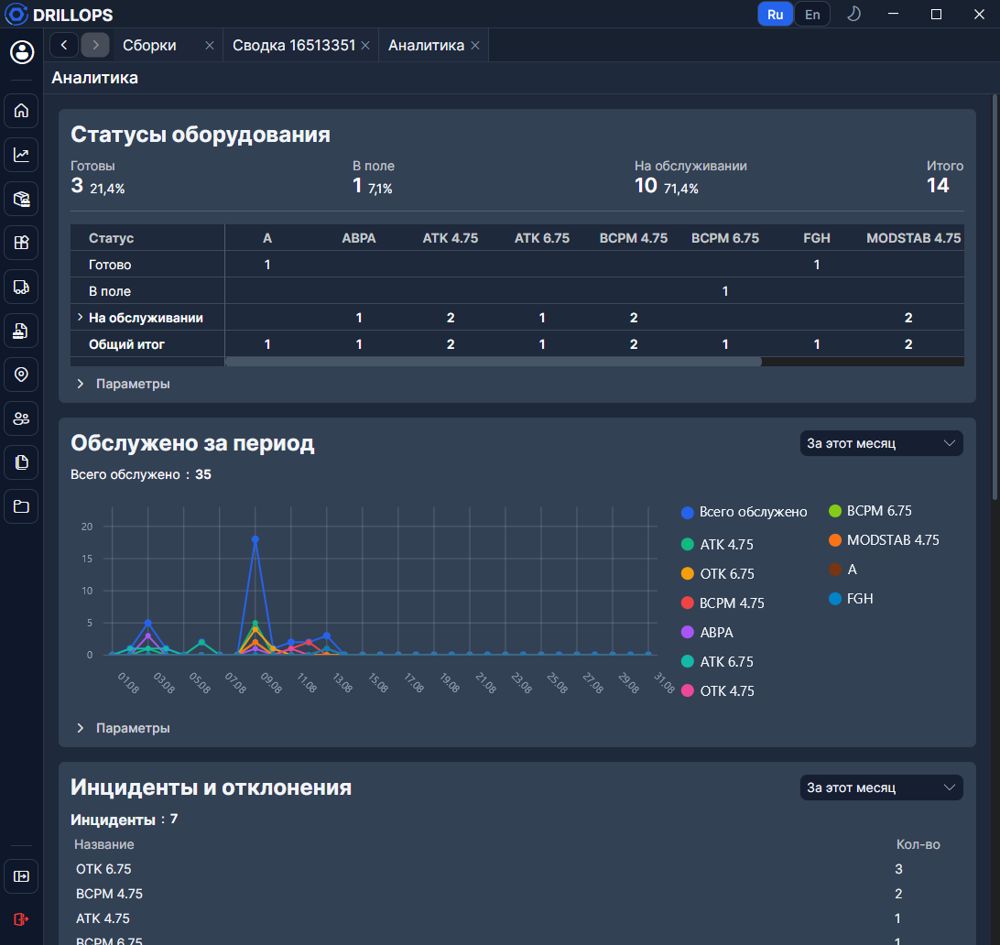

# Аналитика

Сводка по **головным** сборкам парка за выбранный период. Пункт меню **Аналитика** виден тем, у кого доступно [Обслуживание](../Рабочий%20цикл/Обслуживание.md). Данные только для просмотра.

## Блоки

- **Статусы оборудования** — [Готово / В поле / На обслуживании](../Справочники/Статусы%20оборудования.md) и разбивка по [шаблонам](../Справочники/Шаблоны.md).
- **Обслужено за период** — график закрытых нарядов.
- **Инциденты и отклонения** — из [полевых данных](../Рабочий%20цикл/Полевые%20данные.md) и [нарядов](../Рабочий%20цикл/Заказ-наряд.md). Можно сузить по серийному номеру.
- **Отправки по заказчикам** — круговая диаграмма.
- Длительности **MAX · AVG · MIN**: **Срок обслуживания**, **Срок ожидания обслуживания**, **Срок ожидания отправки**, **Срок ожидания запчастей**.

Цифры обновляются из кэша приложения. Чтобы разобрать одну сборку, откройте её [сводку](./Сводка.md).
