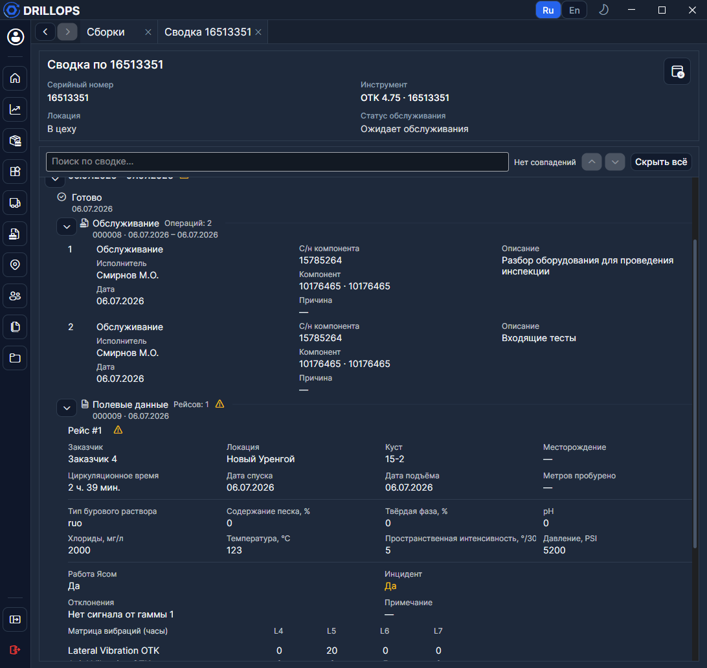

# Сводка

**Сводка** — хронология одной сборки: отправки, полевые данные, обслуживание, возврат в готово. Это не пункт бокового меню — вкладка открывается из контекстного меню **Открыть сводку** на [Главной](../Рабочий%20цикл/Главная.md), в [Сборках](../Справочники/Сборки.md), [Обслуживании](../Рабочий%20цикл/Обслуживание.md), [Отправках](../Рабочий%20цикл/Отправки.md) и из [полевых данных](../Рабочий%20цикл/Полевые%20данные.md).

Нужно право на открытие сводки.

## Лента

Сегменты идут по времени: **Отправка**, **Полевые данные**, **Обслуживание**, **Готово**. Вложенный документ открывают двойным щелчком или кнопкой **Открыть**. У отправок видны [дополнительные инструменты](../Рабочий%20цикл/Отправки.md). Значки предупреждения — **Инцидент** и **Отклонение** (как на [Главной](../Рабочий%20цикл/Главная.md)).

**Раскрыть** / **Раскрыть всё** / **Скрыть всё** управляют детализацией. **Поиск по сводке** подсвечивает совпадения.

## Выгрузка

**Выгрузить в Excel** собирает листы **Сводка**, **Операции**, **Полевые данные**, **Матрицы вибраций**.

Если по этому серийному номеру ещё не было движения, увидите **История отсутствует**.
