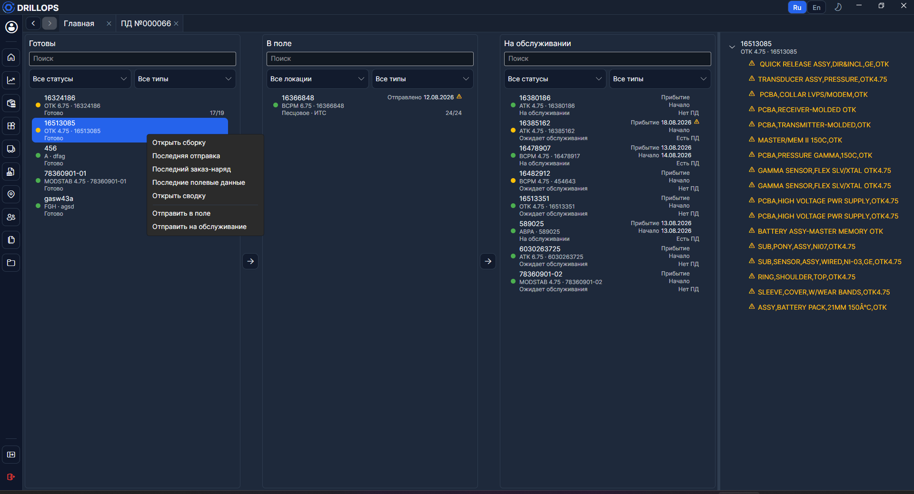
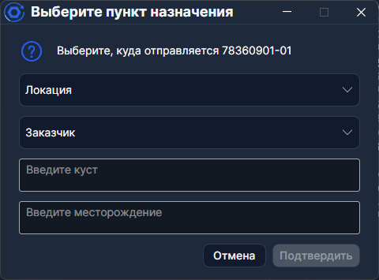

# Главная

На **Главной** три столбца с оборудованием. Сюда попадают [сборки](../Справочники/Сборки.md), собранные на основе [головных инструментов](../Справочники/Компоненты.md).

> С **Ctrl** или **Shift** можно выбрать несколько единиц и отправить их вместе в поле или на обслуживание.

В каждом столбце — поиск по серийному номеру, партийному номеру и наименованию сборки, плюс фильтр **по типу оборудования** ([шаблоны](../Справочники/Шаблоны.md) головных инструментов). Остальные фильтры зависят от столбца.

## Карточка сборки

На скриншоте у каждой строки слева — **индикатор комплектности**: зелёный кружок, если все [слоты](../Справочники/Шаблоны.md) заполнены, жёлтый — если нет. Справа внизу то же цифрами (`3/4`).

В правом верхнем углу карточки — значки предупреждения:

- **Инцидент** — в [полевых данных](./Полевые%20данные.md) отмечен рейс с флагом **Инцидент** (виден в столбце **На обслуживании**, подсказка при наведении).
- **Отклонение** — в последнем [заказ-наряде](./Заказ-наряд.md) есть операция **Отклонение**; значок может остаться и в **Готовы**, и **В поле**.

> Неполную сборку всё равно можно отправить в поле — программа спросит подтверждение (**Сборка … готова на 3/4, вы уверены?**).

Разбор по серийному номеру — в [сводке](../Отчёты/Сводка.md), цифры по парку — в [аналитике](../Отчёты/Аналитика.md).

## Готовы

Сборки со статусом [Готово](../Справочники/Статусы%20оборудования.md). [Отправить в поле](./Отправки.md) или [на обслуживание](./Обслуживание.md) — стрелкой в карточке или через контекстное меню по ПКМ.

Дополнительный фильтр — **по статусу оборудования**.

## В поле

Сборки со статусом [В поле](../Справочники/Статусы%20оборудования.md). Отсюда их отправляют [на обслуживание](./Обслуживание.md) стрелкой или через контекстное меню.

Дополнительный фильтр — [по локации](../Справочники/Локации.md).

## На обслуживании

Сборки со [статусом из категории обслуживания](../Справочники/Статусы%20оборудования.md). Вручную их отсюда не перемещают: после закрытия [обслуживания](./Обслуживание.md) они сами вернутся в **Готовы**.

В строке видно **Есть ПД** / **Нет ПД** — созданы ли [полевые данные](./Полевые%20данные.md).

Дополнительный фильтр — **по статусу оборудования**.

> Пока полевые данные открыты, заказ-наряд из этого столбца не открыть: сначала закройте ПД.

## Структура оборудования

Справа на скриншоте — **текущая** структура выбранной [сборки](../Справочники/Сборки.md). Пустые [слоты](../Справочники/Шаблоны.md) подсвечены предупреждающим цветом.

> Ширину панели меняют, потянув за левый край.
