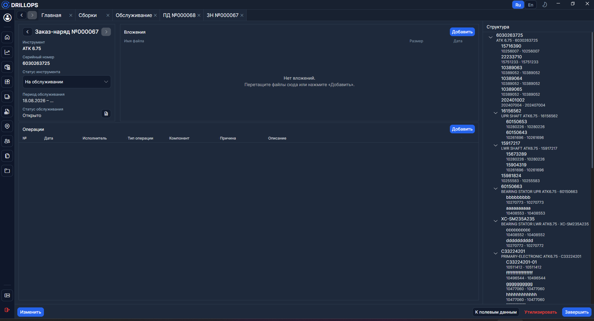
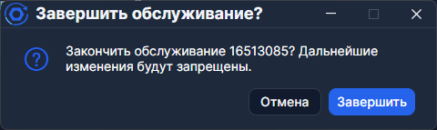

# Заказ-наряд

**Заказ-наряд** (ЗН) — документ работ по обслуживанию сборки. Его открывают из [Обслуживания](./Обслуживание.md), с [Главной](./Главная.md) (пункт **Последний заказ-наряд**) или из [Сборок](../Справочники/Сборки.md). Вкладка называется **ЗН №…** / **Заказ-наряд №…**.

Создать наряд можно кнопкой **+** в таблице обслуживания или автоматически при **Открыть обслуживание** с Главной — но только после закрытых [полевых данных](./Полевые%20данные.md).

Пока наряд открыт, **Структура** — живое дерево сборки. После **Завершить** программа сохраняет снимок: так видно, в каком составе инструмент закрыли.

Кнопки **К обслуживанию** и **Последние полевые данные** / **К полевым данным** ведут к связанным документам.

## Операции

Кнопка **Добавить** открывает мастер создания операции. Подробно про мастер, типы операций и отмену — на отдельной странице [Операции](./Операции.md).

## Вложения

Файлы добавляют кнопкой **Добавить** или перетаскиванием. Их можно скачать и удалить. Менять вложения можно только в режиме **Изменить**.

## Завершение

**Завершить** открывает диалог **Завершить обслуживание?**. Если сборка не укомплектована, программа предупредит и предложит **Завершить всё равно**.

После закрытия обычные правки запрещены. Администратор может переоткрыть документ через **Изменить**.

Отдельно есть действие **Утилизировать** — для списания инструмента, когда его больше не возвращают в парк.

> Если пока вы правили наряд его изменили на сервере, появится баннер **Принять обновление** / **Оставить мои изменения**. Это конфликт редактирования, а не обновление самой программы.
