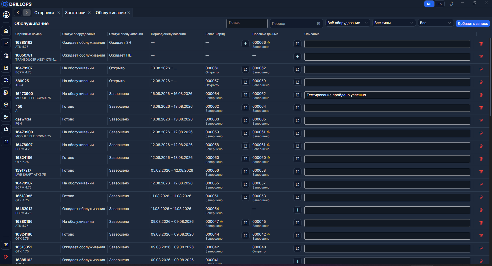
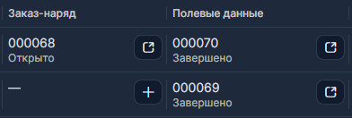

# Обслуживание

Здесь ведут **историю обслуживания** оборудования: создают [полевые данные](./Полевые%20данные.md) и [заказ-наряд](./Заказ-наряд.md), смотрят статус записи.

> Чтобы сохранить текст в **Описании**, нажмите **Enter**.

## Полевые данные и заказ-наряд

В пустой ячейке **Полевые данные** нажмите **+**, чтобы создать документ. Если ПД уже есть — кнопка **открыть**.

Заказ-наряд создаётся так же, из своей ячейки.

> Пока полевые данные не заполнены, заказ-наряд создать нельзя.

С [Главной](./Главная.md) наряд тоже не откроется, пока ПД ещё **Открыто**: сначала закройте полевые данные.

## Поиск и фильтры

Поиск ищет по серийному номеру, наименованию, номеру заказ-наряда, номеру полевых данных и описанию.

Фильтры: по периоду, по [статусу оборудования](../Справочники/Статусы%20оборудования.md), по типу оборудования, по статусу обслуживания.

> В фильтре периода выберите начало и конец — в таблице останутся записи, попавшие в диапазон.

## Статусы обслуживания

Это статус **записи**, не статус самой сборки:

- **Ожидает ПД** — ещё нет полевых данных.
- **Ожидает ЗН** — ПД есть, наряда нет.
- **Открыто** — заказ-наряд открыт, работы идут.
- **Завершено** — наряд закрыт.

> Незавершённые записи всегда выше завершённых.
