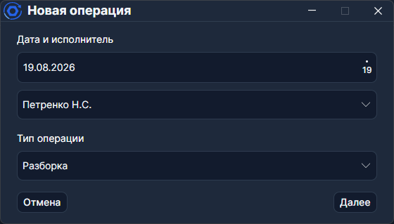
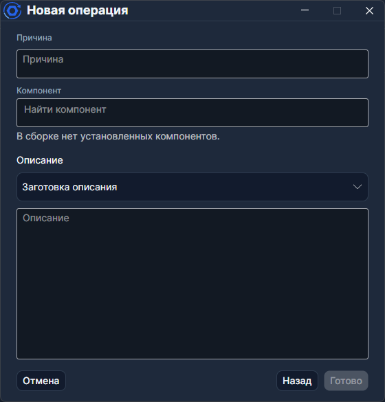

# Операции

Операции — записи о работах внутри [заказ-наряда](./Заказ-наряд.md). Каждая строка в таблице **Операции** описывает одно действие над сборкой или её компонентом: ремонт, замену, инспекцию и т.д.

## Мастер «Новая операция»

Кнопка **Добавить** в таблице операций открывает мастер из двух шагов.

### Шаг 1 — Дата, исполнитель и тип

Выберите **дату**, **исполнителя** и **тип операции**. Если выбран внешний сотрудник, программа допишет «Заполнил: ваше имя».

Тип определяет, что произойдёт дальше — для **Разборки** и **Сборки** появятся дополнительные поля выбора компонента.

### Шаг 2 — Причина, компонент и описание

- **Причина** — обязательное текстовое поле.
- **Описание** — свободный текст. Тут же можно подставить [заготовку описания](../Сервис/Заготовки%20описаний.md): выберите шаблон в списке **Заготовка описания**, и текст заполнится автоматически.

Для операций **Разборка** и **Утилизация** нужно выбрать **компонент** из дерева сборки (список **Извлечь**). Для **Сборки** — **слот**, куда ставить, и **компонент** из доступных.

> При извлечении **сборки** (не простого компонента) появляется флаг **Требует обслуживания**. Если он включён, **извлечённая сборка попадёт на обслуживание**, а не в статус «Готово».

Нажмите **Создать** — операция появится в таблице.

## Типы операций

Не все типы одинаковые: одни меняют структуру сборки, другие фиксируют факт работы, третьи влияют на статус оборудования на [Главной](./Главная.md).

### Работа с компонентом

| Тип            | Что делает                                              |
| -------------- | ------------------------------------------------------- |
| **Разборка**   | Извлекает компонент из слота. Выбор — из дерева сборки. |
| **Сборка**     | Устанавливает компонент в свободный слот.               |
| **Утилизация** | Извлекает и списывает компонент.                        |

### Работы и проверки

| Тип                    | Что делает                                |
| ---------------------- | ----------------------------------------- |
| **Ремонт**             | Фиксирует ремонт.                         |
| **Обслуживание**       | Техническое обслуживание.                 |
| **Инспекция**          | Визуальный / инструментальный осмотр.     |
| **Опрессовка**         | Гидравлическое испытание.                 |
| **вход. Тестирование** | Проверка при поступлении на обслуживание. |
| **исх. Тестирование**  | Проверка при завершении обслуживания.     |

### Документирующие

| Тип               | Что делает                                                                                     |
| ----------------- | ---------------------------------------------------------------------------------------------- |
| **Инцидент**      | Фиксирует инцидент в наряде.                                                                   |
| **Отклонение**    | Даёт значок предупреждения на [Главной](./Главная.md) и в [аналитике](../Отчёты/Аналитика.md). |
| **Расследование** | Запись о расследовании причин.                                                                 |

### Статусные

| Тип                    | Что делает                                          |
| ---------------------- | --------------------------------------------------- |
| **Ожидание запчастей** | Меняет статус оборудования на **Ожидает запчасти**. |
| **Карантин**           | Меняет статус на **Карантин**.                      |

## Отмена операции

**Отменить операцию** не удаляет строку — запись остаётся в журнале со статусом **Отменена**, а эффекты (извлечение, установка, смена статуса) откатываются.

По умолчанию отменённые операции скрыты. Ссылка **Показать N отменённых** раскрывает их в таблице.

> Отменить можно только **верхнюю** (последнюю) операцию.

## Таблица операций

Колонки: **№**, **Дата**, **Исполнитель**, **Тип операции**, **Уровень**, **Компонент**, **С/н компонента**, **Причина**, **Описание**. Все эти поля видны на скриншоте [заказ-наряда](./Заказ-наряд.md).

Операция типа **Отклонение** выделяется значком — тем же, что появляется на [Главной](./Главная.md) в карточке сборки.
