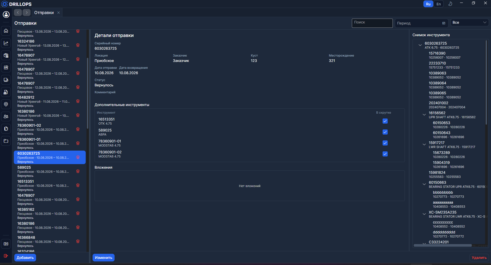
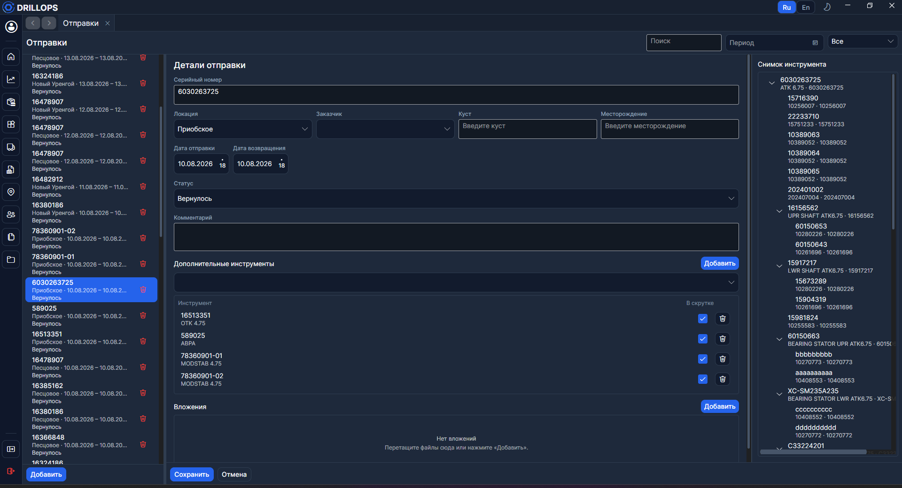

# Отправки

**Отправки** — журнал рейсов: какая [сборка](../Справочники/Сборки.md) куда уехала, когда вернулась и в каком составе.

Справа — **снимок инструмента** на момент отправки: структура зафиксирована, не «живая».

## Список и поиск

> Дата возвращения ставится сама, когда сборку с [Главной](./Главная.md) отправляют на обслуживание.

> Ширину списка меняют, потянув за правый край панели.

Поиск — по серийному номеру и [локации](../Справочники/Локации.md). Фильтры: **по периоду** и **по статусу** (**Отправлено** / **Вернулось**).

> В фильтре периода выберите начало и конец диапазона — в списке останутся только отправки, попавшие в эти даты.

## Режим редактирования

Режим доступен при соответствующих правах. Менять можно **комментарий**, **дополнительные инструменты** и **вложения**. Локация, заказчик и даты задаются при отправке с Главной.

### Дополнительные инструменты

Нужны, когда несколько единиц уехали вместе и «в скрутке». Выберите сборку в списке и нажмите **Добавить**, затем при необходимости включите флаг **В скрутке**.

> Если с [Главной](./Главная.md) в поле отправили **несколько** сборок сразу, они попадут в дополнительные инструменты автоматически (флаг **В скрутке** включён).

В список добавления попадают сборки с той же локацией и датой отправки.

### Вложения

Прикрепить файлы можно кнопкой **Добавить** или перетаскиванием. По умолчанию размер одного файла не больше 100 МБ. После загрузки файл могут скачать другие пользователи.
