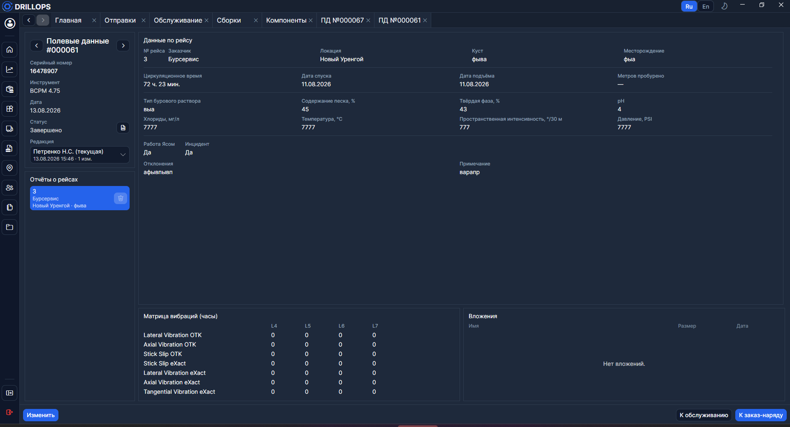
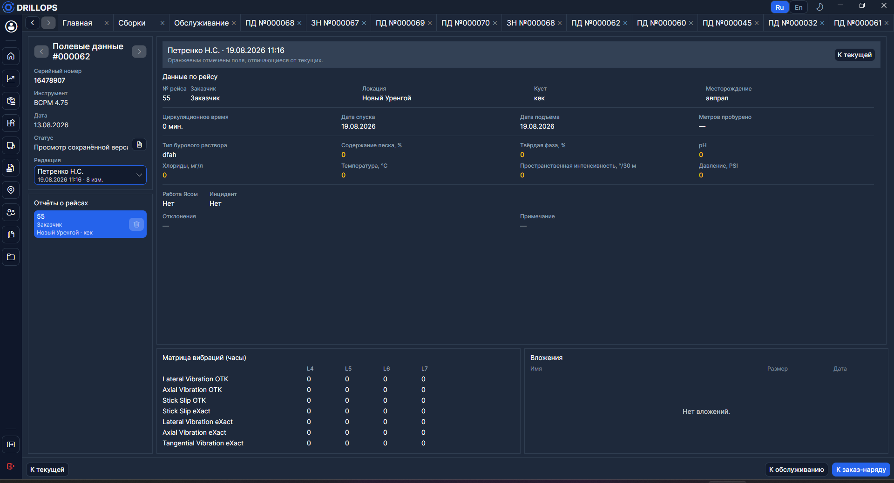

# Полевые данные

Здесь ведут отчёты по рейсам для текущего обслуживания [сборки](../Справочники/Сборки.md). Документ привязан к записи на вкладке [Обслуживание](./Обслуживание.md).

## Навигация и редакции

- **Предыдущий документ** / **Следующий документ** — переход по истории полевых данных этой сборки.
- **Открыть сводку** — открывает вкладку [Сводка](../Отчёты/Сводка.md).
- **К обслуживанию** и **К заказ-наряду** — переход к связанным документам. Если наряда ещё нет, его можно создать отсюда после закрытия ПД.

> **Редакция** — сохранённая версия полевых данных. Пользователь с соответствующими правами может править уже завершённые данные (**Изменить**); после сохранения в списке редакций появляется новая версия.

> При просмотре старой редакции значения, которые отличаются от актуальных, подсвечиваются предупреждающим цветом. Кнопка **К текущей** возвращает к последней версии.

## Отчёты о рейсах

Нажмите строку в списке рейсов, чтобы открыть её данные справа. Новые рейсы — **Добавить отчёт**, удаление — **Удалить отчёт**.

**Импорт** копирует данные рейса из другого документа полевых данных.

## Данные по рейсу

В карточке рейса указывают [заказчика](../Справочники/Заказчики.md), [локацию](../Справочники/Локации.md), параметры бурения и раствора, флаг **Инцидент**, матрицы вибраций.

Вложения к рейсу можно добавить только после того, как рейс сохранён.

## Завершение

Пока документ **Открыто**, его можно дополнять. **Завершить** закрывает внесение данных — дальше правки обычным пользователям запрещены.

> Пока ПД не закрыты, с [Главной](./Главная.md) нельзя открыть заказ-наряд: сначала завершите полевые данные.
