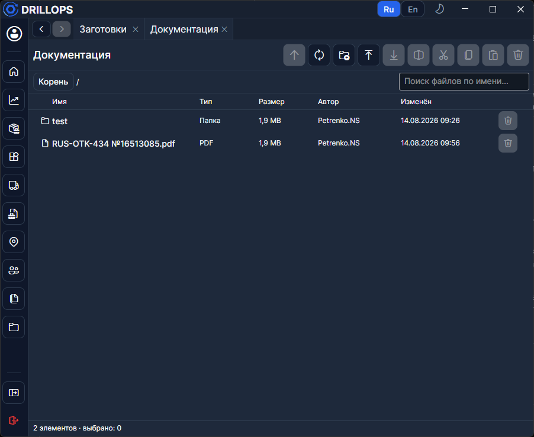

# Документация

Файловый архив **на сервере**, внутри Desktop. Это не данное руководство на сайте, а папки и файлы вашей организации: инструкции, бланки, схемы.

Нужно право на раздел **Документация**. Запись — отдельное право.

## Проводник

**Поиск** ищет по всему дереву **по названиям**; в режиме поиска появляется колонка **Путь**.

При праве записи: **Создать папку**, **Загрузить**, **Переименовать**, **Вырезать** / **Копировать** / **Вставить**, **Удалить**. **Скачать** — на компьютер, **Открыть** — во внешней программе.

Можно выделить несколько строк сразу.
