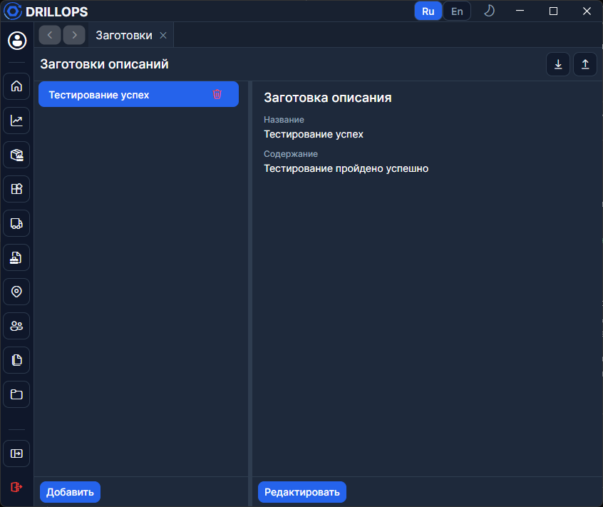
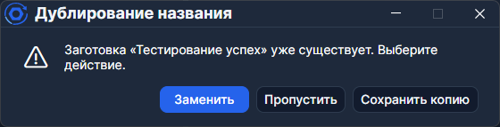

# Заготовки описаний

Справочник текстов для операций [заказ-наряда](../Рабочий%20цикл/Заказ-наряд.md). В меню пункт **Заготовки**, страница — **Заготовки описаний**. Раздел доступен всем пользователям.

## Карточка

У заготовки — **Название** и **Содержание**. В мастере **Новая операция** на шаге **Описание** выберите **Заготовка описания** — текст подставится в операцию.

## Импорт и экспорт

**Экспорт** сохраняет заготовки в JSON, **Импорт** загружает такой файл. При конфликте имён — **Заменить**, **Пропустить** или **Сохранить копию**. 
**Применить ко всем** повторяет выбор для остальных.

