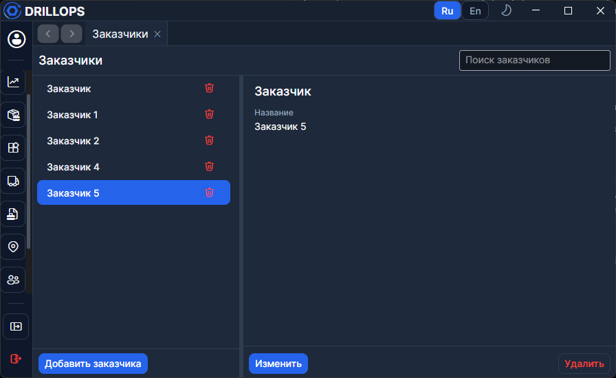

# Заказчики

Справочник организаций, куда уезжает инструмент. Заказчика выбирают при [отправке в поле](../Рабочий%20цикл/Отправки.md) и в отчётах [полевых данных](../Рабочий%20цикл/Полевые%20данные.md).

## Как работать

- **Добавить заказчика** — новая карточка. Обязательно **Название**.
- **Изменить** → правки → **Сохранить** или **Отмена**.
- **Удалить** — с подтверждением.

Кнопки создания и правки видны только при праве записи.

> Если карточку одновременно меняют на сервере, появится баннер **Принять обновление** / **Оставить мои изменения**.
