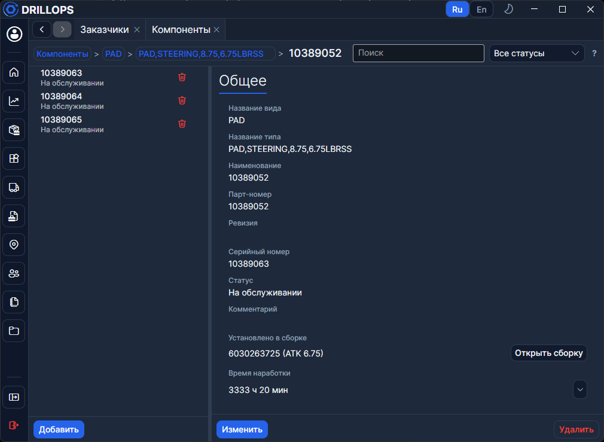
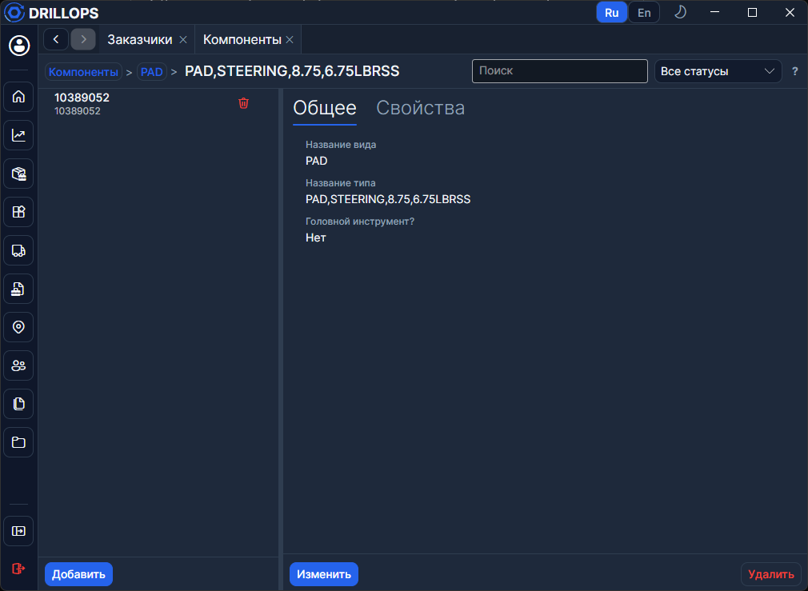

# Компоненты

Номенклатура деталей РУС: от видов и типов до экземпляров с серийным номером. Иерархия **Вид → Тип → Вариант → Компонент** — по дереву ходят хлебными крошками.

Сверху — **Поиск** и фильтр по [статусу оборудования](./Статусы%20оборудования.md).

## Головные инструменты

На уровне **Типа** стоит флаг **Головной инструмент?**. Только сборки по шаблонам таких типов попадают на [Главную](../Рабочий%20цикл/Главная.md).

>Там же задают **пороги матрицы вибраций в часах**.

## Карточка компонента

Серийный номер и парт-номер должны быть уникальными.

Компонент либо **не установлен**, либо стоит в [сборке](./Сборки.md). Из дерева сборки его назначают в слот или извлекают.
