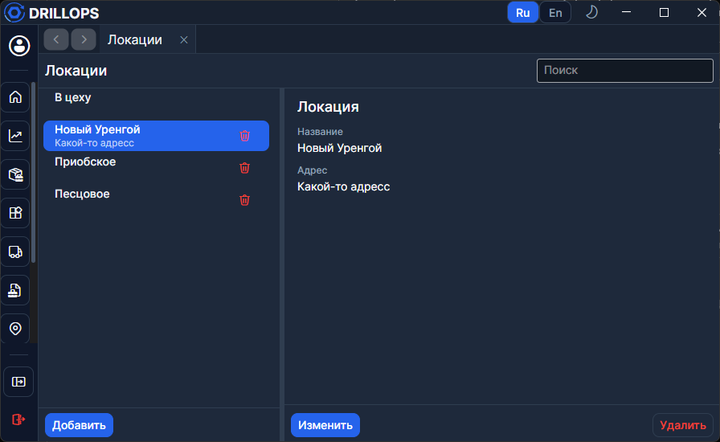

# Локации

Справочник мест. Это **не** привязка к [заказчику](./Заказчики.md): локации живут отдельно.

Локацию выбирают, когда с [Главной](../Рабочий%20цикл/Главная.md) отправляют сборку в поле. В колонке **В поле** по локации можно фильтровать. В рейсе [полевых данных](../Рабочий%20цикл/Полевые%20данные.md) — это месторождение / объект бурения.

## Как работать

Обязательно **Название**, опционально **Адрес**. **Добавить** / **Изменить** / **Сохранить** / **Удалить** — как у других справочников.

Первой в списке всегда системная локация **В цеху** — её нельзя удалить.
