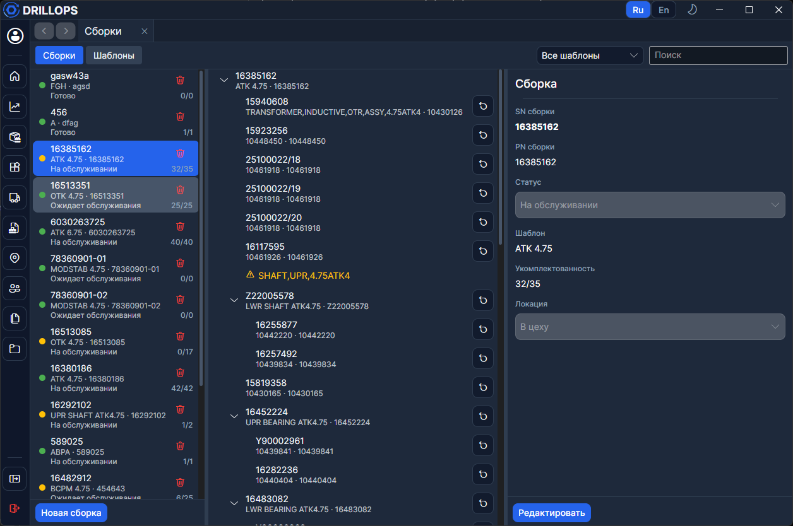

# Сборки

**Сборка** — экземпляр инструмента: корневой [компонент](./Компоненты.md) плюс дерево слотов по [шаблону](./Шаблоны.md). На вкладке два режима: **Сборки** и **Шаблоны** (переключатель сверху).

## Дерево и комплектация

Пустой слот подписан **типом компонента** который должен в нём находится. **Укомплектованность** N/M — сколько слотов занято (та же логика, что индикатор на [Главной](../Рабочий%20цикл/Главная.md)).

> Неполная сборка всё равно может уехать в поле — программа спросит подтверждение. То же при закрытии [заказ-наряда](../Рабочий%20цикл/Заказ-наряд.md).

В слот назначают компонент (**Назначить компонент**), лишний снимают (**Извлечь**). Один компонент не может стоять в двух сборках сразу.

## Создание

Новую сборку собирают из **шаблона**, корневого **компонента** и парт-номера. На [Главную](../Рабочий%20цикл/Главная.md) попадают только сборки головных инструментов.

Контекстное меню строки открывает [последнюю отправку](../Рабочий%20цикл/Отправки.md), [наряд](../Рабочий%20цикл/Заказ-наряд.md), [полевые данные](../Рабочий%20цикл/Полевые%20данные.md) или [сводку](../Отчёты/Сводка.md).
