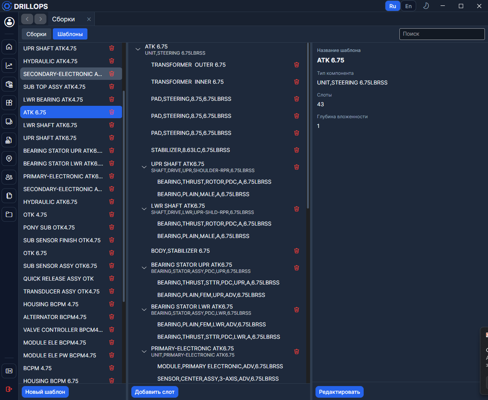

# Шаблоны

**Шаблоны** — не отдельный пункт меню, а режим на вкладке [Сборки](./Сборки.md). Переключатель **Сборки / Шаблоны** сверху страницы.

Шаблон описывает слоты типа инструмента: какой [тип компонента](./Компоненты.md) в какой ячейке ждать. По шаблону потом собирают экземпляры.

## Как устроен шаблон

- На один **Тип** материала — один шаблон.
- **Слоты**: **Добавить слот** / **Удалить слот**, для каждого — ожидаемый тип.
- **Используется в** — какие сборки уже построены по этому шаблону. Если сборок нет — **Не используется**.

Нельзя удалить шаблон, который уже стоит в сборках. Циклические вложения шаблонов программа блокирует.
