# Как завести сборку

Сборка — единица оборудования в DrillOps. Пока она не создана, отправлять в поле и обслуживать нечего. Ниже — путь от пустого справочника до готовой сборки на [Главной](../Рабочий%20цикл/Главная.md).

---

## Шаг 1. Откройте справочник «Компоненты»

В боковом меню нажмите **Компоненты**.

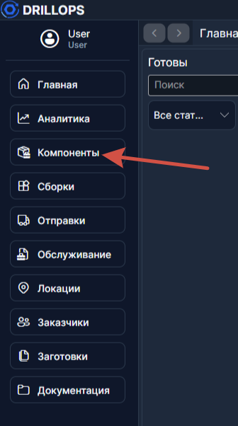

---

## Шаг 2. Создайте вид

Нажмите кнопку **Добавить** на верхнем уровне дерева. Введите название вида (например, *Units*) и сохраните.

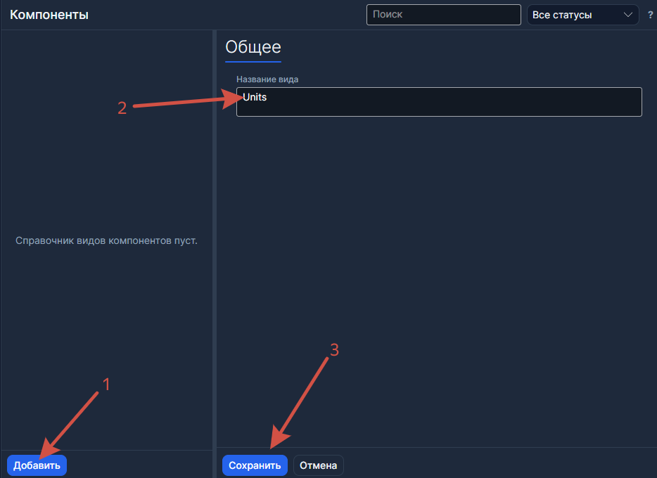

> **Вид** — широкая категория оборудования. Нужен только для группировки; на логику программы не влияет.

---

## Шаг 3. Создайте тип внутри вида

Выберите созданный вид в дереве и нажмите **Добавить** на уровне типа. Введите название (например, *Unit Base*).

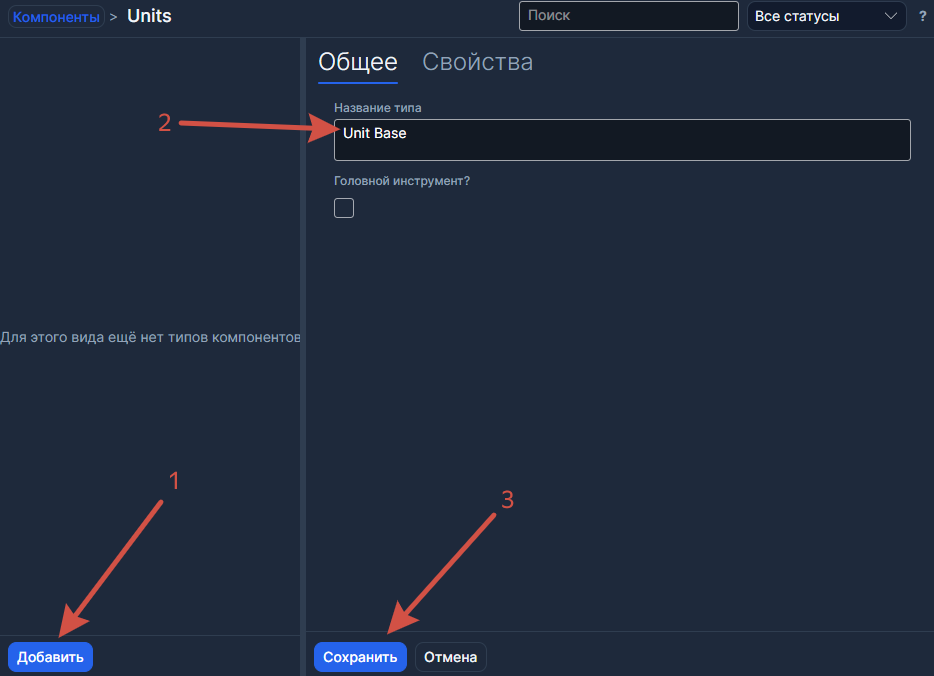

> **Тип** определяет взаимозаменяемость. Все компоненты одного типа могут встать в один и тот же слот шаблона. Подробнее — в [FAQ](../FAQ.md#что-означает-иерархия-вид--тип--вариант--компонент).

---

## Шаг 4. Включите флаг «Головной инструмент?» (если нужно)

Если этот тип — корневой элемент сборки, в карточке типа включите флаг **Головной инструмент?**.

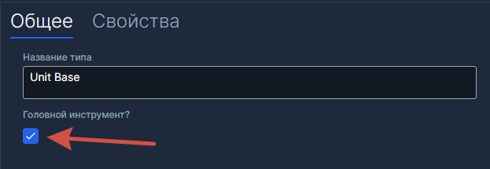

> Без этого флага сборки по шаблонам этого типа **не появятся** на Главной.

> Если это корневой элемент сборки, но эту сборку не планируете отправлять в поля самостоятельно, то не ставьте этот флаг. Вложенную сборку можно создать без него.
---

## Шаг 5. Создайте вариант внутри типа

Выберите тип и нажмите **Добавить** на уровне варианта. Укажите **наименование** (спецификацию) и **парт-номер**.

Например: наименование — *Unit Base 0.5*, парт-номер — *A111B22*.

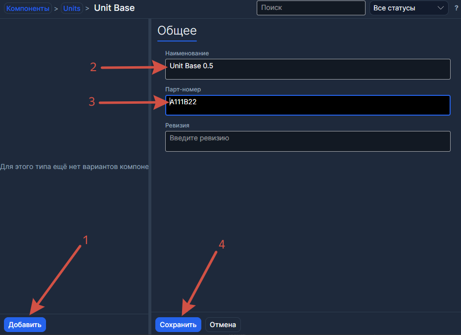

> **Вариант** — конкретная спецификация. У одного типа может быть несколько вариантов (**Unit Base 0.5*, **Unit Base 0.6*) — они взаимозаменяемы в сборке.

---

## Шаг 6. Создайте компонент внутри варианта

Выберите вариант и нажмите **Добавить** на уровне компонента. Введите уникальный **серийный номер**.

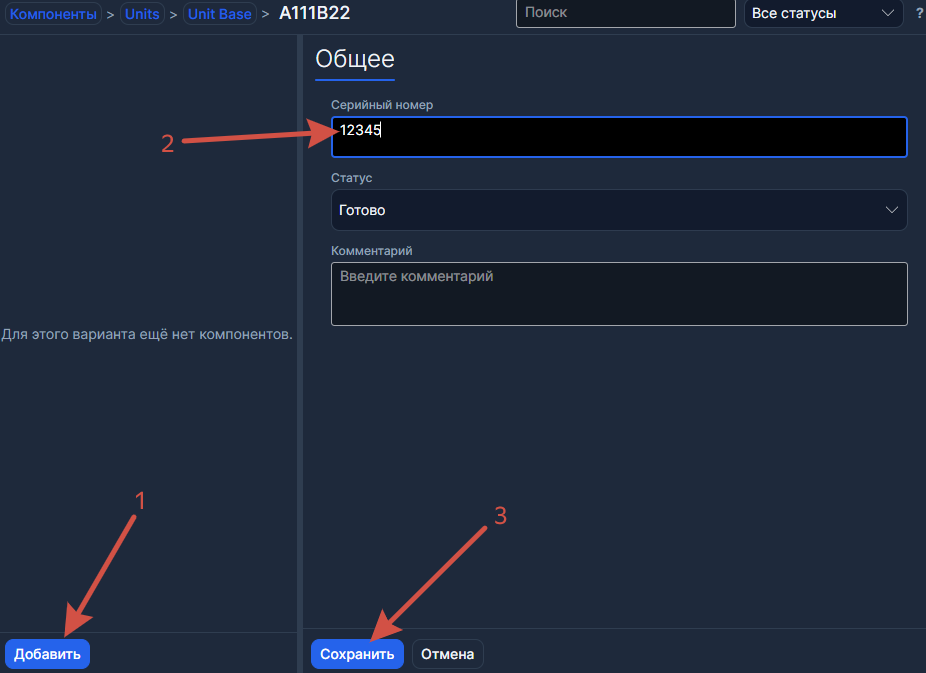

> **Компонент** — физический экземпляр, который вы держите в руках. Именно его ставят в сборку.

---

## Шаг 7. Повторите для остальных деталей

Создайте все компоненты, которые войдут в сборку: корневой (головной инструмент) и вложенные. Для каждого пройдите шаги 2–6 (вид и тип, скорее всего, уже созданы — добавляйте варианты и компоненты).

>⚠️ **Не перепутайте Тип и Вариант!** Каждый **тип** — это отдельная группа взаимозаменяемых деталей. **Если завести все компоненты** сборки (корпус, лопасти, переводники…) под **одним типом**, **шаблон не сможет различить слоты** и выдаст ошибку зацикливания. **Правило простое: разные детали — разные типы, разные парт-номера одной и той же детали — варианты внутри одного типа.**

---

## Шаг 8. Откройте вкладку «Сборки» → режим «Шаблоны»

В боковом меню нажмите **Сборки**. Вверху страницы переключитесь в режим **Шаблоны**.

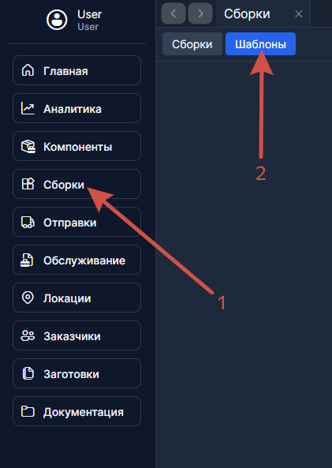

---

## Шаг 9. Создайте шаблон

Нажмите **Создать**. Выберите **тип** головного инструмента (если у него был включён флаг **Головной инструмент?** на шаге 4, то сборки этого шаблона будут отображаться на **Главной**).

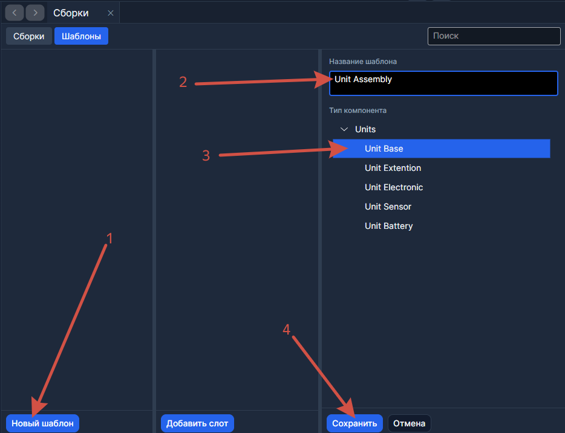

---

## Шаг 10. Добавьте слоты в шаблон

Нажмите **Добавить слот**. Для каждого слота укажите **ожидаемый тип компонента** — тот тип, который должен в нём стоять.

Повторите для всех слотов.

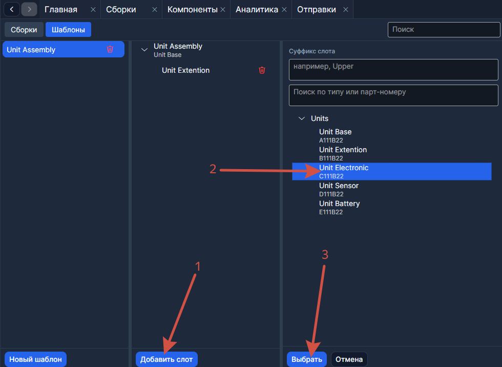

> Шаблон можно создать один раз и использовать для нескольких сборок одного типа.

---

## Шаг 11. Создайте вложенные сборки (если нужно)

Слот шаблона может ожидать не просто компонент, а **другую сборку** — например, стабилизатор со своей внутренней структурой. В этом случае:

1. Создайте **отдельный шаблон** для вложенной сборки (повторите шаги 9–10 для её типа).
2. Переключитесь в режим **Сборки** и создайте вложенную сборку по этому шаблону.
3. Укомплектуйте её компонентами.

Потом, когда будете собирать основную сборку (шаги 13–14), в слот можно будет назначить готовую вложенную сборку целиком.

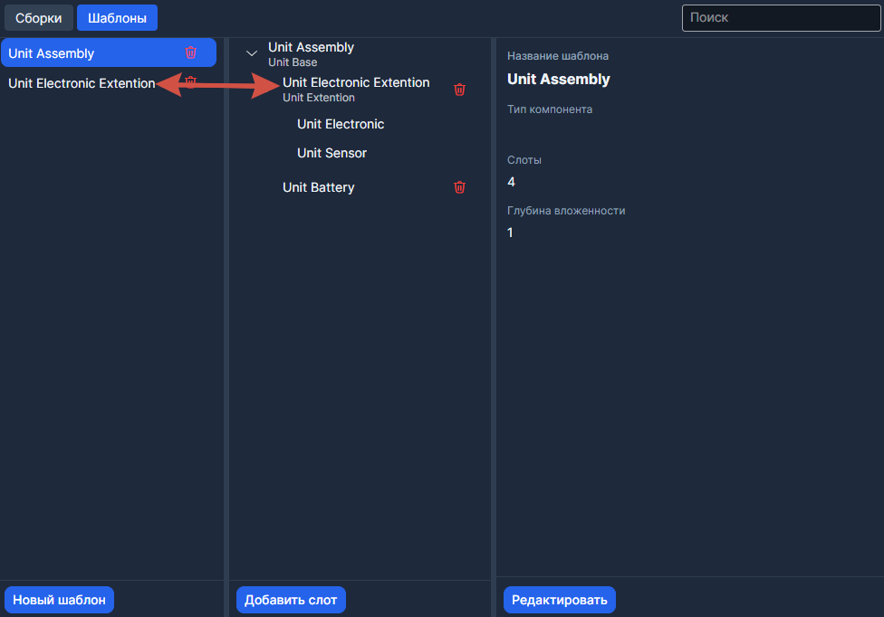

> Вложенная сборка — это полноценная сборка со своим серийным номером и шаблоном. Она не обязана быть головным инструментом (флаг **Головной инструмент?** для неё не нужен).

---

## Шаг 12. Переключитесь в режим «Сборки»

Вверху страницы переключитесь обратно в режим **Сборки**.

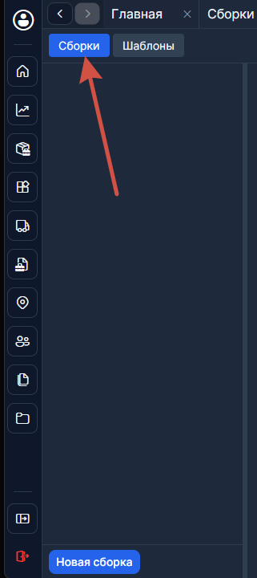

---

## Шаг 13. Создайте сборку

Нажмите **Создать**. В диалоге укажите:

- **Шаблон** — выберите шаблон, созданный на шаге 9 (или шаге 11, если это вложенная сборка).
- **Корневой компонент** — выберите компонент головного инструмента (созданный на шаге 6).
- **Парт-номер** — заполнится автоматически или введите вручную.

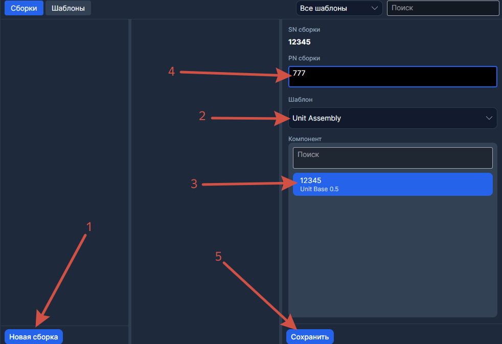

Программа покажет дерево с пустыми слотами.

---

## Шаг 14. Назначьте компоненты в слоты

Выберите пустой слот в дереве и нажмите **Назначить компонент**. В появившемся списке выберите нужный компонент.

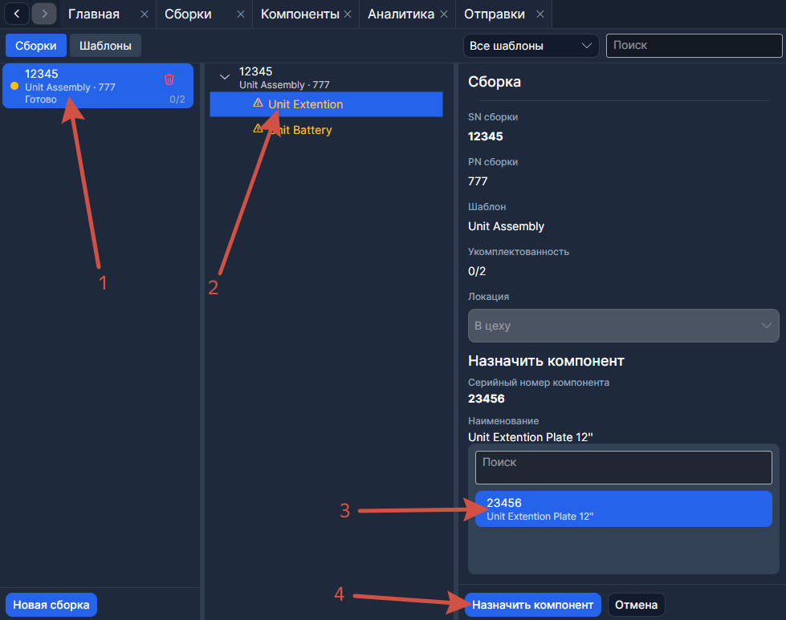

Повторите для каждого слота.

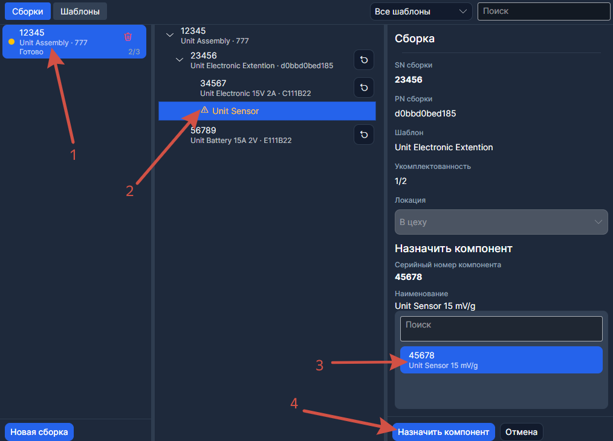

> Один компонент не может стоять в двух сборках одновременно. Если нужного компонента нет в списке — он уже где-то назначен.

---

## Шаг 15. Проверьте укомплектованность

Посмотрите на индикатор **Укомплектованность** (N/M). Когда все слоты заполнены, он покажет, например, *3/3*.

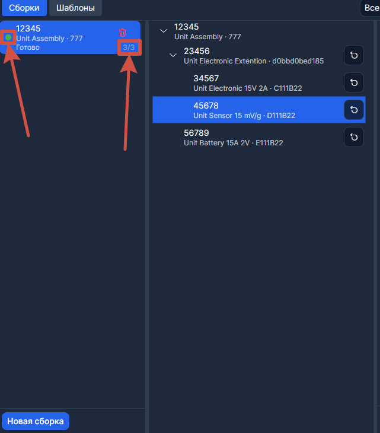

---

## Шаг 16. Убедитесь, что сборка появилась на Главной

Откройте [Главную](../Рабочий%20цикл/Главная.md). Если корневой компонент в статусе **Готово**, сборка будет в столбце **Готовы**.

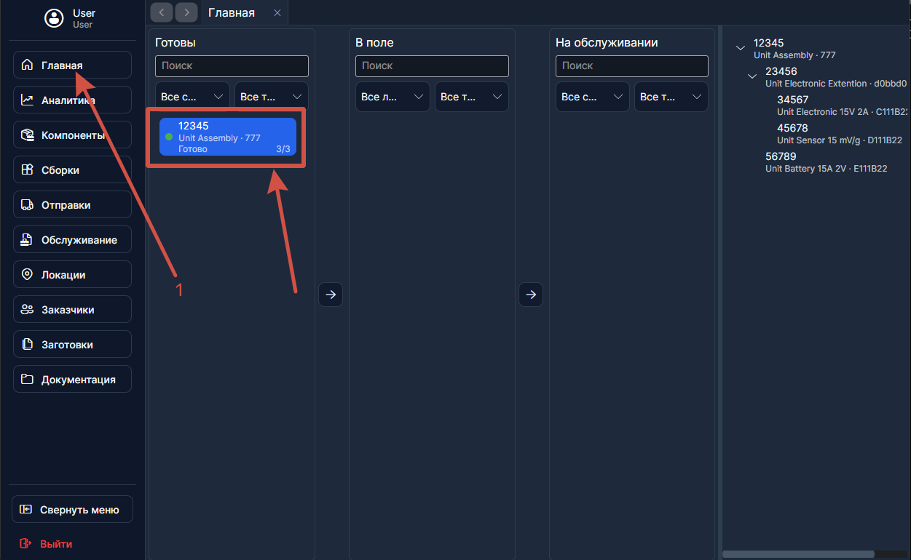

Готово! Теперь сборку можно [отправить в поле](./Как%20отправить%20в%20поле.md).

> Неполная сборка тоже может уехать — программа спросит подтверждение.
