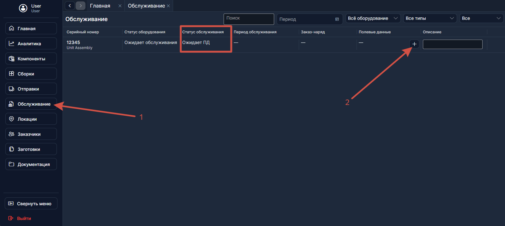
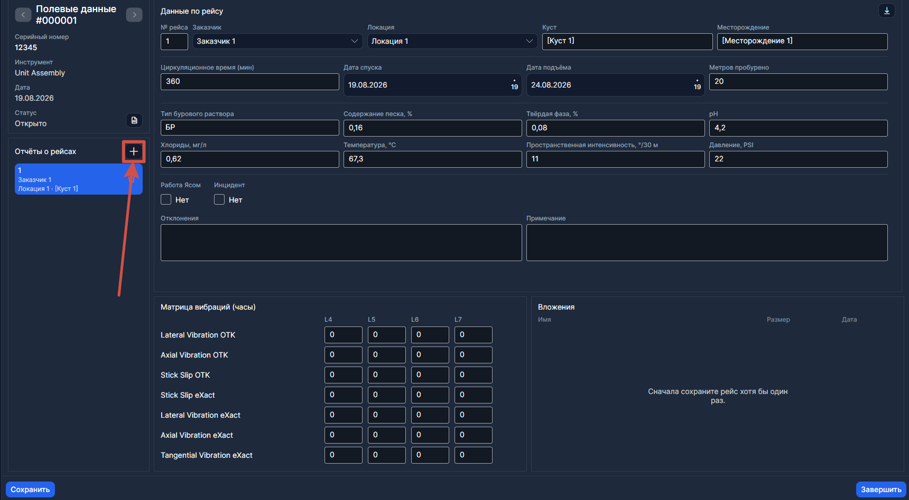
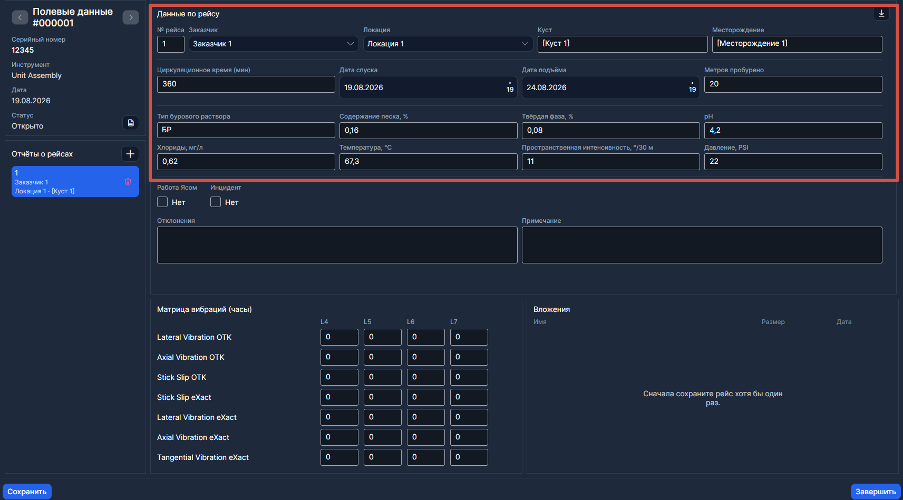
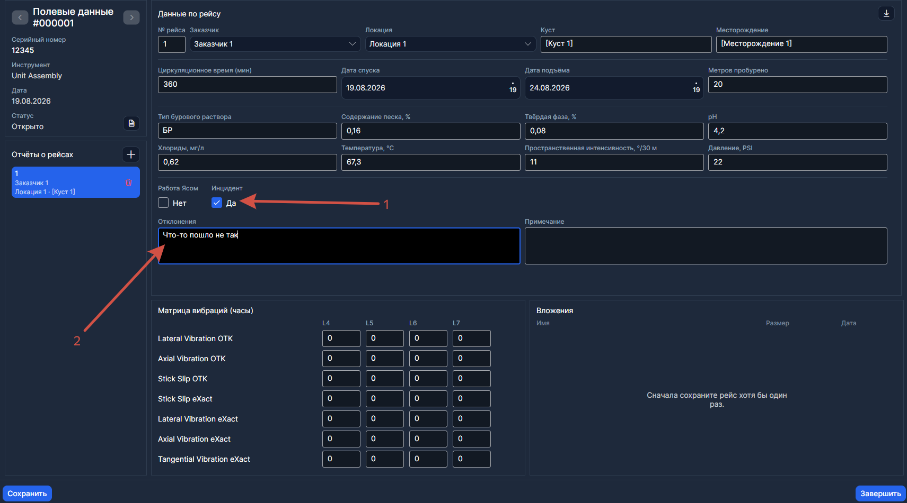
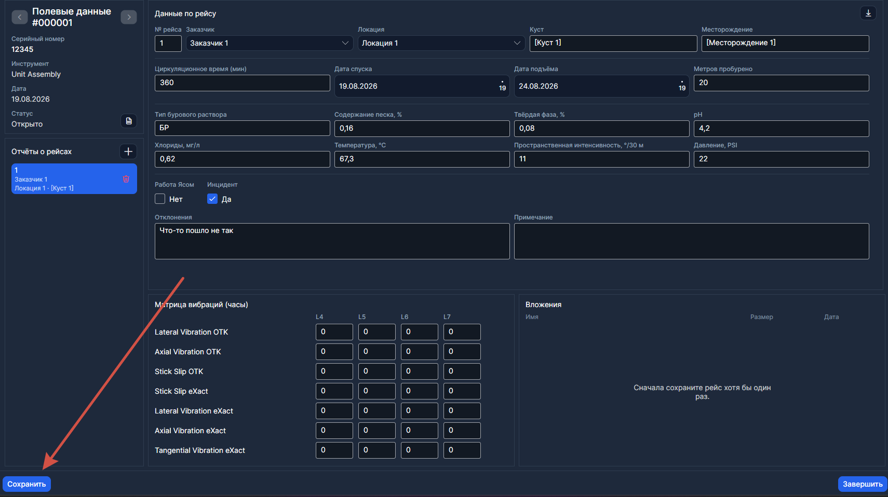
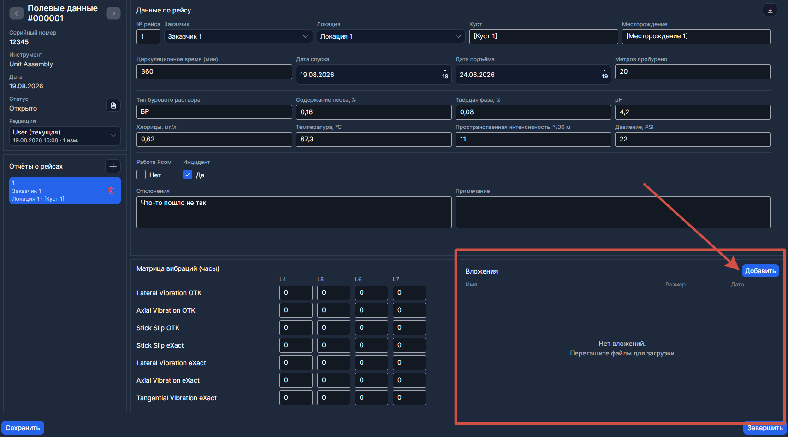
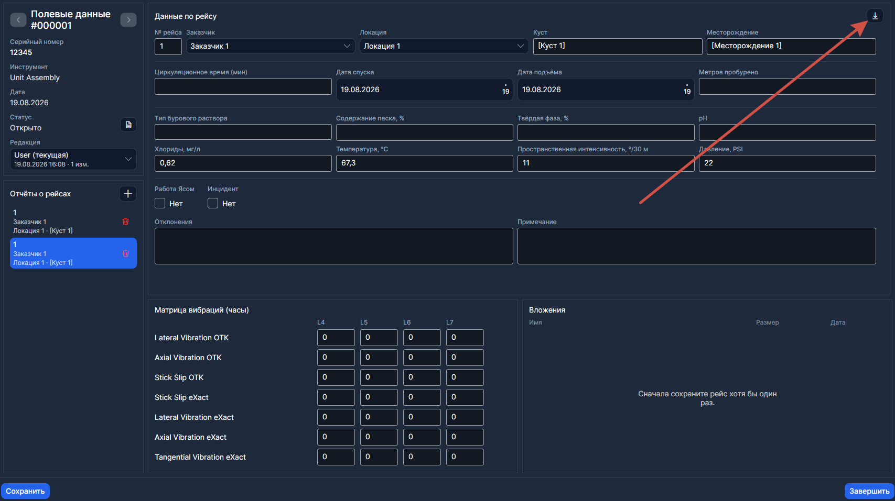
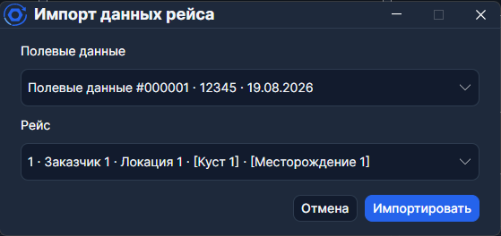
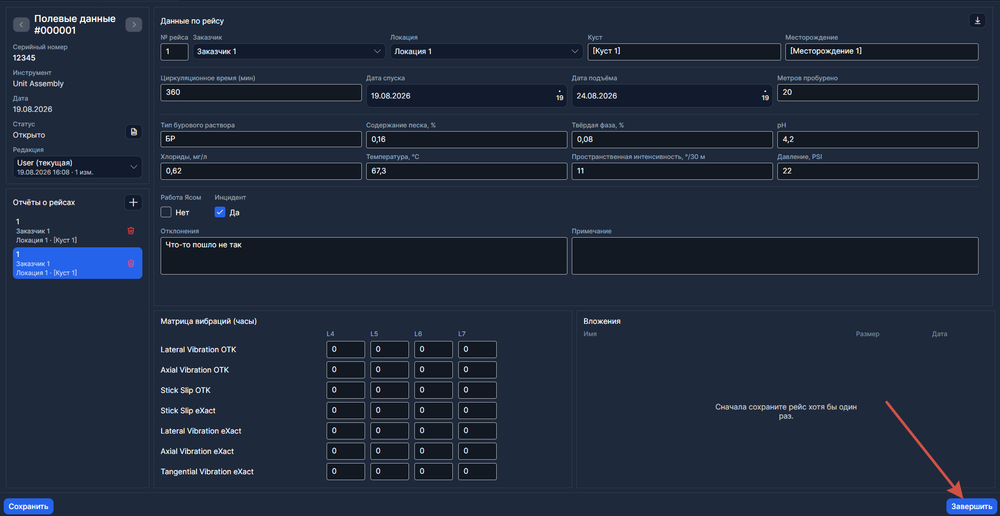

# Как заполнить полевые данные

Сборка вернулась с поля и стоит в столбце **На обслуживании** на [Главной](../Рабочий%20цикл/Главная.md). Первый шаг — внести полевые данные. Пока они не закрыты, [заказ-наряд](../Рабочий%20цикл/Заказ-наряд.md) создать нельзя.

---

## Шаг 1. Откройте «Обслуживание», найдите сборку и создайте ПД

В боковом меню нажмите **Обслуживание**. Используйте строку **Поиск** — введите серийный номер или наименование. Когда найдёте нужную запись в статусе **Ожидает ПД**, в ячейке **Полевые данные** нажмите кнопку **+**.

Откроется вкладка [Полевые данные](../Рабочий%20цикл/Полевые%20данные.md).

---

## Шаг 2. Добавьте отчёт о рейсе

Нажмите кнопку **Добавить отчёт**.

---

## Шаг 3. Заполните данные рейса

**Заказчик** и **Локация** подтянутся автоматически из отправки. Заполните остальные поля: параметры бурения (глубина, метраж, часы), параметры раствора, матрицы вибраций.

---

## Шаг 4. Отметьте инцидент (если был)

Если во время рейса произошёл инцидент — включите флаг **Инцидент**. Также заполните поле **Отклонения** — опишите, что именно случилось.

> Инцидент отобразится значком на карточке сборки на [Главной](../Рабочий%20цикл/Главная.md).

---

## Шаг 5. Сохраните отчёт

Нажмите **Сохранить**. После сохранения можно прикрепить вложения.

---

## Шаг 6. Прикрепите файлы (если нужно)

Нажмите **Добавить** в области вложений или перетащите файлы. Это могут быть отчёты от заказчика, графики, фото.

---

## Шаг 7. Добавьте ещё рейсы (если были)

Если рейсов было несколько — повторите шаги 2–6 для каждого.

> **Импорт** позволяет скопировать данные из другого документа полевых данных, если параметры повторяются.

---

## Шаг 8. Завершите полевые данные

Когда все рейсы внесены, нажмите кнопку **Завершить**.

Документ получит статус **Завершено**. Обычные правки после этого закрыты.

> Если позже понадобится правка — пользователь с правами может нажать **Изменить**. Появится новая **редакция**, старые версии сохранятся.

---

## Что дальше

Полевые данные закрыты — теперь можно [провести обслуживание](./Как%20провести%20обслуживание.md) и открыть заказ-наряд.
