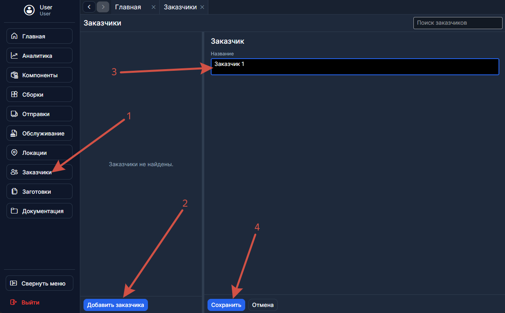
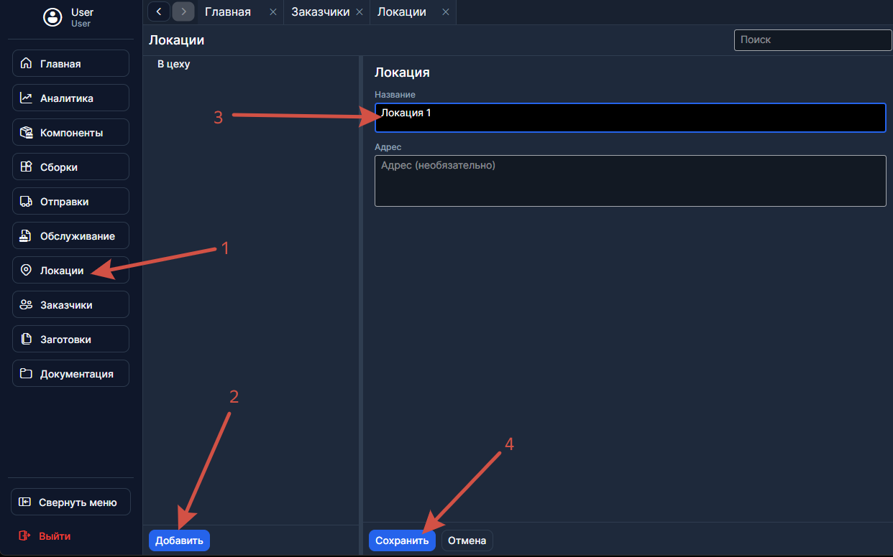
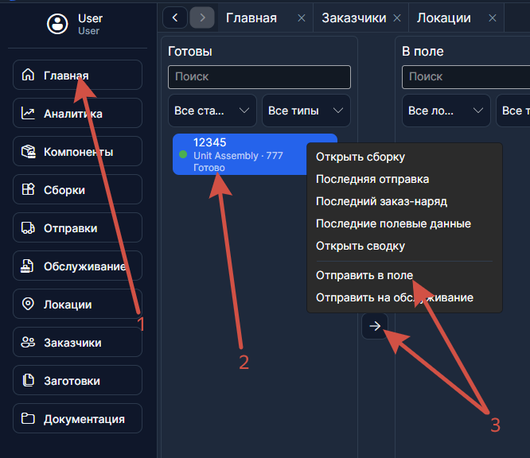
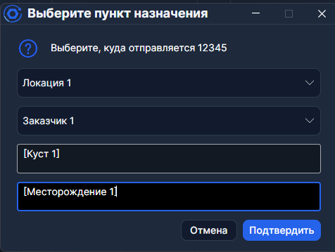
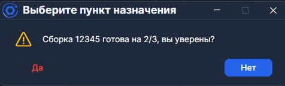
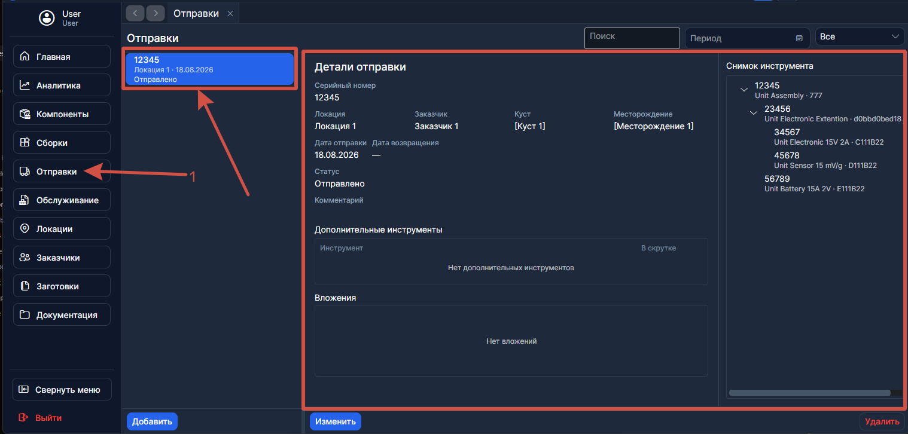

# Как отправить в поле

Сборка стоит в столбце **Готовы** на [Главной](../Рабочий%20цикл/Главная.md). Ниже — как отправить её заказчику.

---

## Шаг 1. Убедитесь, что заказчик существует

Откройте [Заказчики](../Справочники/Заказчики.md) в боковом меню. Если нужного заказчика нет — нажмите **Добавить** и создайте его.

---

## Шаг 2. Убедитесь, что локация существует

Откройте [Локации](../Справочники/Локации.md). Если нужного объекта нет — нажмите **Добавить** и создайте локацию.

> Системную локацию **В цеху** не трогайте — она назначается автоматически.

---

## Шаг 3. Выберите сборку на Главной и отправьте в поле

Откройте **Главную**. В столбце **Готовы** нажмите на карточку нужной сборки, затем нажмите **Отправить в поле**.

> Чтобы выбрать **несколько** сборок, зажмите **Ctrl** (по одной) или **Shift** (диапазон).

---

## Шаг 4. Заполните диалог отправки

В открывшемся диалоге укажите:

- **Локацию** — куда едет инструмент.
- **Заказчика** — кому принадлежит объект.
- **Куст** и **Месторождение**

---

## Шаг 5. Подтвердите отправку

Нажмите **Отправить**. Если сборка не полностью укомплектована, программа предупредит — подтвердите, если всё в порядке.

---

## Шаг 6. Проверьте результат

Сборка переместилась в столбец **В поле** на Главной.

В журнале [Отправок](../Рабочий%20цикл/Отправки.md) появилась запись со снимком структуры. Дата возвращения заполнится автоматически, когда сборку вернут на обслуживание.

---

## Что дальше

Когда инструмент возвращается с поля, отправьте его **на обслуживание** с Главной. Затем — [заполните полевые данные](./Как%20заполнить%20полевые%20данные.md).
