# Как провести обслуживание

Полевые данные закрыты, запись на вкладке [Обслуживание](../Рабочий%20цикл/Обслуживание.md) в статусе **Ожидает ЗН**. Пора открыть заказ-наряд и провести работы.

---

## Шаг 1. Откройте «Обслуживание», найдите сборку и создайте заказ-наряд

В боковом меню нажмите **Обслуживание**. Используйте строку **Поиск** — введите серийный номер или наименование. Когда найдёте нужную запись в статусе **Ожидает ЗН**, в ячейке **Заказ-наряд** нажмите кнопку **+**.

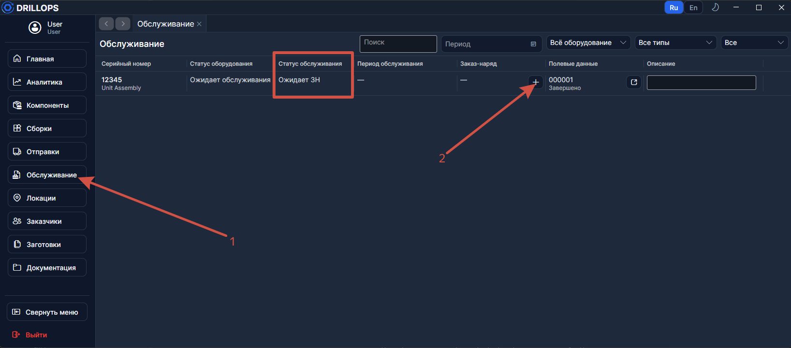

Откроется вкладка [Заказ-наряд](../Рабочий%20цикл/Заказ-наряд.md).

---

## Шаг 2. Нажмите «Добавить» операцию

В таблице **Операции** нажмите кнопку **Добавить**. Откроется [мастер новой операции](../Рабочий%20цикл/Операции.md).

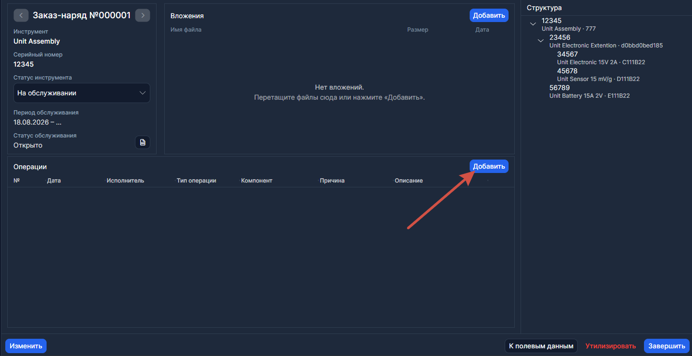

---

## Шаг 3. Шаг 1 мастера — выберите дату, исполнителя и тип

- **Дата** — когда выполнялась работа.
- **Исполнитель** — кто делал.
- **Тип операции** — что именно делали (Инспекция, Ремонт, Разборка и т.д.).

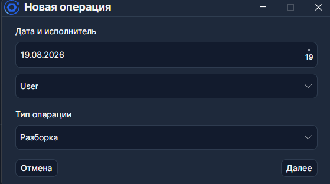

Нажмите **Далее**.

---

## Шаг 4. Шаг 2 мастера — заполните детали

- **Причина** — обязательное поле. Кратко опишите, зачем операция.
- **Описание** — подробности. Можно подставить [заготовку описания](../Сервис/Заготовки%20описаний.md) из выпадающего списка.

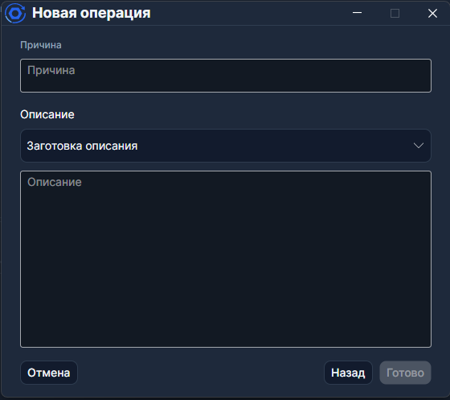

---

## Шаг 5. Выберите компонент (для Разборки / Сборки / Утилизации)

Этот шаг появляется только для типов, которые работают с компонентами:

- **Разборка** / **Утилизация** — выберите компонент из дерева сборки в списке **Извлечь**.
- **Сборка** — выберите **слот** (куда ставить) и **компонент** (что ставить).

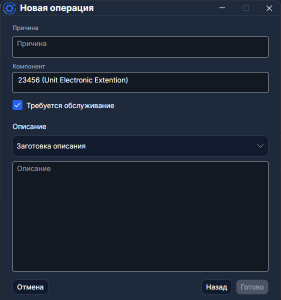

> При извлечении **сборки** (не простого компонента) появится флаг **Требует обслуживания** — если включить, извлечённая сборка попадёт на обслуживание.

---

## Шаг 6. Нажмите «Готово»

Операция появится в таблице.

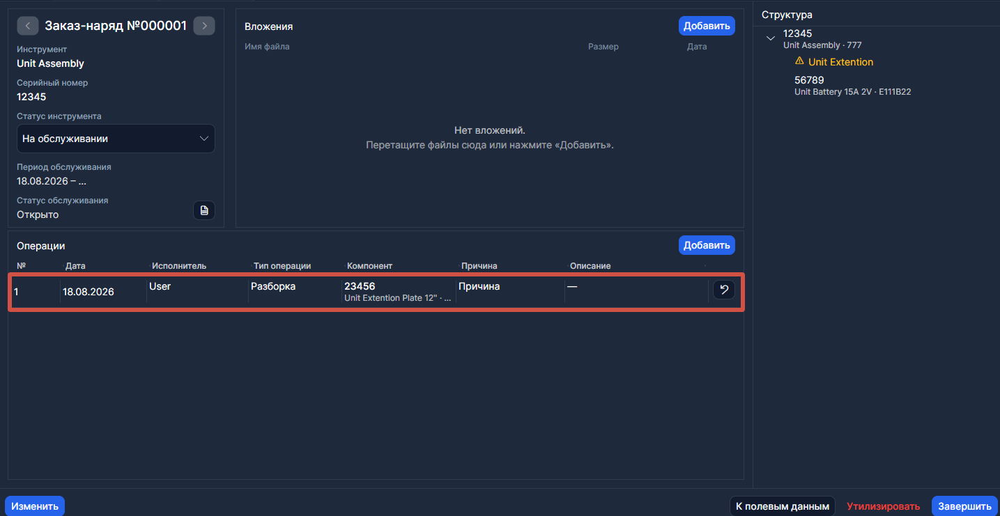

---

## Шаг 7. Добавьте остальные операции

Повторите шаги 4–8 для каждой работы. Типичные наборы:

| Ситуация                        | Операции                                                       |
| ------------------------------- | -------------------------------------------------------------- |
| Осмотр без замен                | **Инспекция** → **вход. Тестирование** → **исх. Тестирование** |
| Замена компонента               | **Разборка** (извлечь старый) → **Сборка** (поставить новый)   |
| Ремонт                          | **Ремонт**                                                     |
| Списание детали                 | **Утилизация**                                                 |
| Не возможно полностью обслужить | **Отклонение**                                                 |

---

## Шаг 8. Проверьте структуру

Посмотрите раздел **Структура** справа — это живое дерево сборки. После каждой Разборки или Сборки оно обновляется. Убедитесь, что индикатор **Укомплектованность** показывает нужное значение.

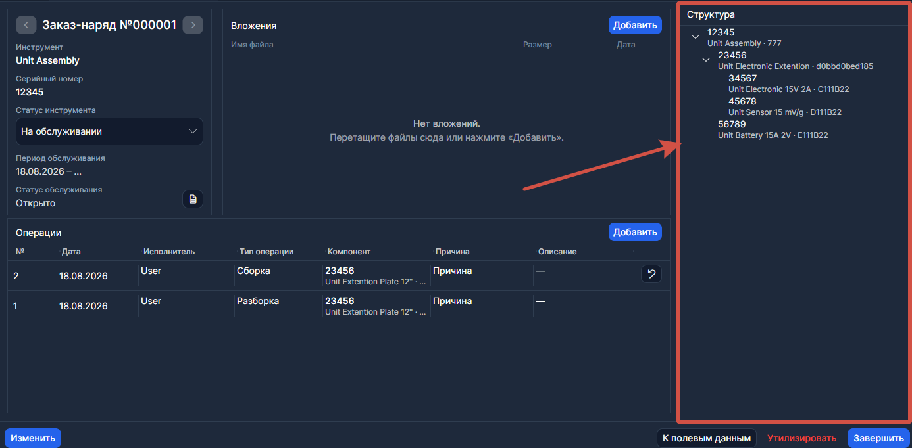

---

## Шаг 9. Прикрепите вложения (если нужно)

Перейдите в раздел **Вложения**. Нажмите **Добавить** или перетащите файлы (акты, фото, протоколы).

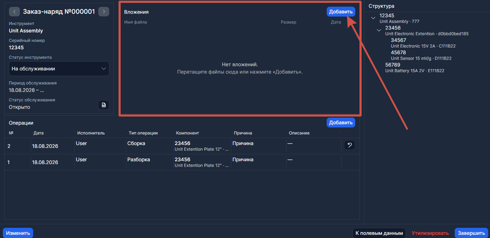

---

## Шаг 10. Нажмите «Завершить»

Когда все операции внесены, нажмите кнопку **Завершить**.

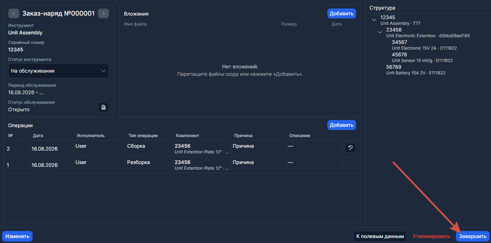

---

## Шаг 11. Подтвердите завершение

Откроется диалог **Завершить обслуживание?**.

- Если сборка **полностью укомплектована** — просто нажмите **Завершить**.
- Если **не укомплектована** — программа предупредит. Нажмите **Завершить всё равно**, если это допустимо.

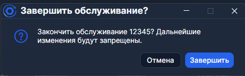

---

## Шаг 12. Проверьте результат

- Запись обслуживания получила статус **Завершено**.
- Структура зафиксирована как снимок.
- Сборка вернулась в столбец **Готовы** на [Главной](../Рабочий%20цикл/Главная.md).

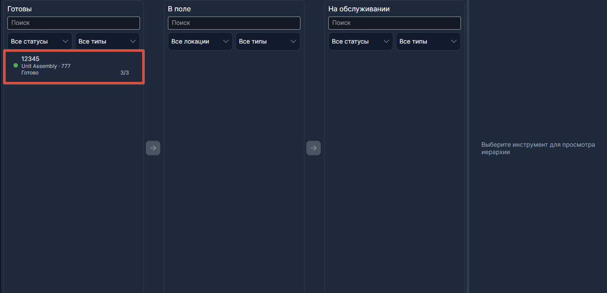

Готово! Сборка снова готова к [отправке в поле](./Как%20отправить%20в%20поле.md).

---

## Где потом смотреть историю

- **[Сводка](../Отчёты/Сводка.md)** — полная хронология по серийному номеру.
- **[Аналитика](../Отчёты/Аналитика.md)** — статистика по всему парку за период.
